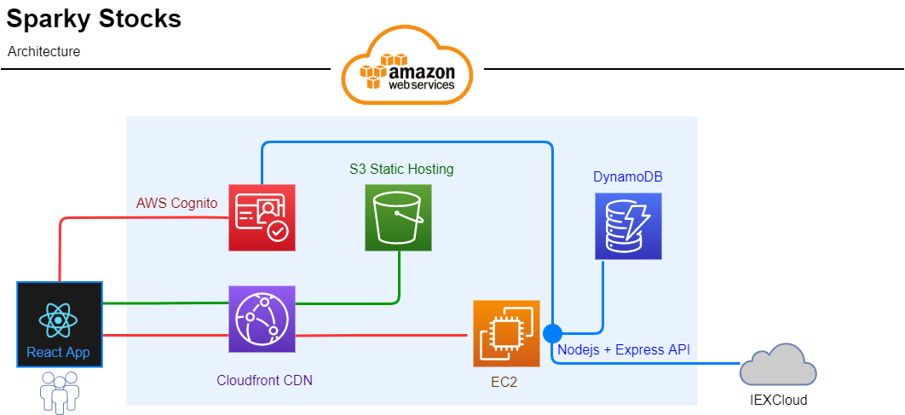

# SparkyStocks

This wasn't just a fun programming activity...It's Sparky's preferred platform to monitor stocks! Check it out -> [sparkystocks.com](https://sparkystocks.com)

## How it was built

SparkyStocks is a full-stack solution built on AWS.

### Frontend 

Built with React and Scss, and hosted directly from an S3 bucket. 

### Backend 

I built a REST API using nodejs + express hosted from an EC2 instance. AWS Cognito provides identity for authenticating with protected routes, and DynamoDB is used to store stock symbols for each customer account. I'm using IEXCloud to provide stock quotes.

## Usage

