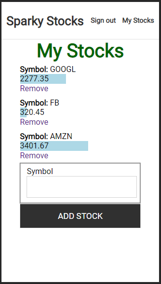

# SparkyStocks

This wasn't just a fun programming activity...It's Sparky's preferred platform to monitor stocks! Check it out -> [sparkystocks.com](https://sparkystocks.com)

## How it was built

SparkyStocks is a full-stack solution built on AWS.

### Frontend 

Built with React and hosted directly from an S3 bucket. 

This app supports account signup, login, email verification, and password reset. Your portfolio may only be built and accessed after logging in.

For styling, I used SCSS throughout the application, and focused on a responsive, screen-agnostic design. For the bar graph, I leveraged stylized components and set the width of each respective bar as a percentage of the total portfolio;

### Backend 

I built a REST API using nodejs + express hosted from an EC2 instance. AWS Cognito provides identity for authenticating with protected routes, and DynamoDB is used to store stock symbols for each customer account. I'm using IEXCloud to provide stock quotes.

## Usage

Sign in with demo credentials (provided via email), or create your own account! Once logged in, navigate to "My Stocks", enter a symbol, and hit "ADD STOCK". Stocks may also be removed from the portfolio.

